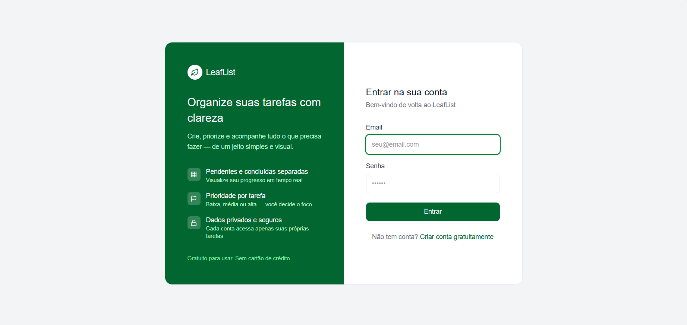
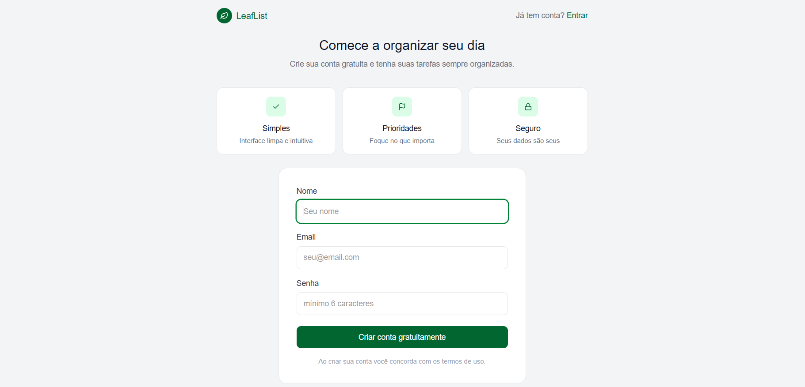
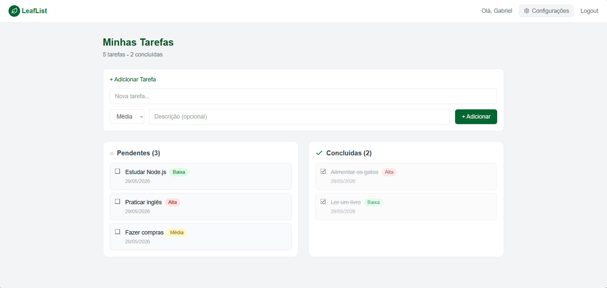
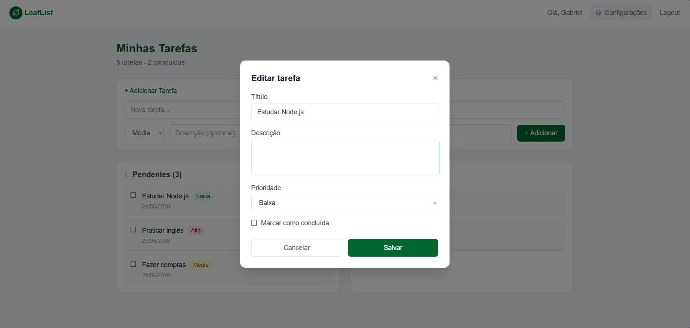
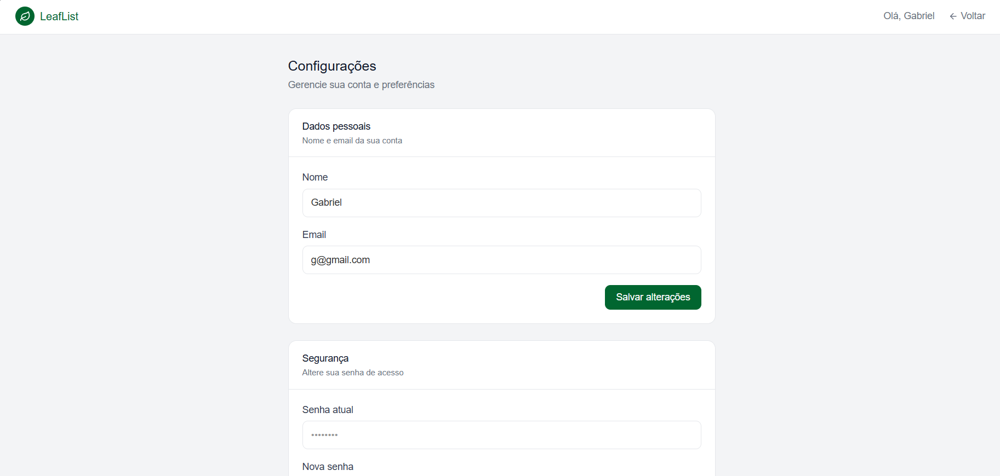

<div align="center">
  <h1>🌿 LeafList</h1>
  <p>Gerenciador de tarefas fullstack com autenticação, prioridades e interface moderna.</p>


</div>

---

## 📋 Sobre o projeto

O **LeafList** é uma aplicação fullstack de gerenciamento de tarefas desenvolvida do zero. Cada usuário possui sua própria conta com dados isolados, podendo criar, priorizar, editar e concluir tarefas em uma interface limpa e responsiva.

O projeto foi construído com foco em boas práticas de mercado: arquitetura em camadas no backend, estado global no frontend, autenticação JWT, persistência real em PostgreSQL e testes automatizados.

---

## ✨ Funcionalidades

- 🔐 **Autenticação completa** — registro, login e logout com JWT
- ✅ **CRUD de tarefas** — criar, editar, concluir e deletar
- 🏷️ **Prioridades** — baixa, média e alta com badges coloridos
- 📋 **Visualização em colunas** — pendentes e concluídas separadas
- 📊 **Resumo estatístico** — contador de tarefas por status
- ⚙️ **Painel de configurações** — alterar nome, email e senha
- 🗑️ **Exclusão de conta** — com confirmação inline por email
- 🔒 **Isolamento de dados** — cada usuário acessa apenas suas tarefas

---

## 🖼️ Screenshots

### Página de Login



### Página de Registro



### Dashboard — Tarefas



### Modal de Edição



### Painel de Configurações



---

## 🗂️ Estrutura do projeto

```
LeafList/
├── backend/               # API REST em Node.js
│   ├── src/
│   │   ├── controllers/   # Camada HTTP — traduz req/res
│   │   ├── services/      # Lógica de negócio pura
│   │   ├── routes/        # Definição de rotas
│   │   ├── middlewares/   # Autenticação JWT
│   │   ├── workers/       # Worker Threads
│   │   └── prisma.js      # Instância única do Prisma
│   ├── prisma/
│   │   ├── schema.prisma  # Modelagem do banco
│   │   └── migrations/    # Histórico de migrações
│   └── app.js             # Entrada da aplicação
│
└── frontend/              # SPA em React
    └── src/
        ├── components/    # Componentes reutilizáveis
        ├── pages/         # Páginas da aplicação
        ├── context/       # Estado global (AuthContext, TarefasContext)
        └── services/      # Camada de comunicação com a API
```

---

## 🛠️ Tecnologias

### Backend

| Tecnologia         | Uso                                              |
| ------------------ | ------------------------------------------------ |
| **Node.js**        | Runtime JavaScript no servidor                   |
| **Express.js**     | Framework HTTP e roteamento                      |
| **Prisma ORM**     | Acesso ao banco de dados com type-safety         |
| **PostgreSQL**     | Banco de dados relacional (hospedado no Neon)    |
| **JWT**            | Autenticação stateless com tokens                |
| **bcryptjs**       | Hash seguro de senhas                            |
| **Worker Threads** | Processamento paralelo sem bloquear a event loop |
| **Vitest**         | Testes automatizados de serviços                 |

### Frontend

| Tecnologia                | Uso                                         |
| ------------------------- | ------------------------------------------- |
| **React 18**              | Biblioteca de interface com hooks modernos  |
| **Vite**                  | Bundler e servidor de desenvolvimento       |
| **React Router v6**       | Roteamento client-side com rotas protegidas |
| **Tailwind CSS v4**       | Estilização com classes utilitárias         |
| **Context API**           | Gerenciamento de estado global              |
| **Lucide React**          | Biblioteca de ícones                        |
| **React Testing Library** | Testes de componentes                       |

---

## 🚀 Como rodar localmente

### Pré-requisitos

- Node.js 18+
- Conta no [Neon](https://neon.tech) (PostgreSQL gratuito)

### Backend

```bash
# Acesse a pasta do backend
cd backend

# Instale as dependências
npm install

# Configure as variáveis de ambiente
cp .env.example .env
# Edite o .env com sua DATABASE_URL do Neon, JWT_SECRET e JWT_EXPIRA_EM

# Aplique as migrations
npx prisma migrate dev

# Gere o Prisma Client
npx prisma generate

# Inicie o servidor
npm run dev
```

### Frontend

```bash
# Acesse a pasta do frontend
cd frontend

# Instale as dependências
npm install

# Configure as variáveis de ambiente
cp .env.example .env.development
# Edite com: VITE_API_URL=http://localhost:3000

# Inicie o servidor de desenvolvimento
npm run dev
```

Acesse `http://localhost:5173` no browser.

---

## 🧪 Testes

```bash
# Backend
cd backend
npm run test

# Frontend
cd frontend
npm run test
```

---

## 🌐 Deploy

| Serviço        | Plataforma                     |
| -------------- | ------------------------------ |
| Backend        | [Railway](https://railway.app) |
| Frontend       | [Vercel](https://vercel.com)   |
| Banco de dados | [Neon](https://neon.tech)      |

---

## 📄 Variáveis de ambiente

### Backend (`.env`)

```
DATABASE_URL=
JWT_SECRET=
JWT_EXPIRA_EM=7d
PORT=3000
```

### Frontend (`.env.development` / `.env.production`)

```
VITE_API_URL=
```

---

## 📐 Arquitetura

O backend segue uma arquitetura em camadas com responsabilidades bem definidas:

```
Requisição HTTP
      ↓
   Router        → mapeia URL para controller
      ↓
  Controller     → valida req, chama service, responde
      ↓
   Service       → lógica de negócio, acessa banco
      ↓
  Prisma Client  → gera SQL e executa no PostgreSQL
```

O frontend usa Context API para estado global, separando autenticação (`AuthContext`) de dados da aplicação (`TarefasContext`), com uma camada de serviços centralizando todas as chamadas HTTP.

---

<div align="center">
  <p>Desenvolvido por <strong>Gabrielhbrz</strong></p>
</div>
